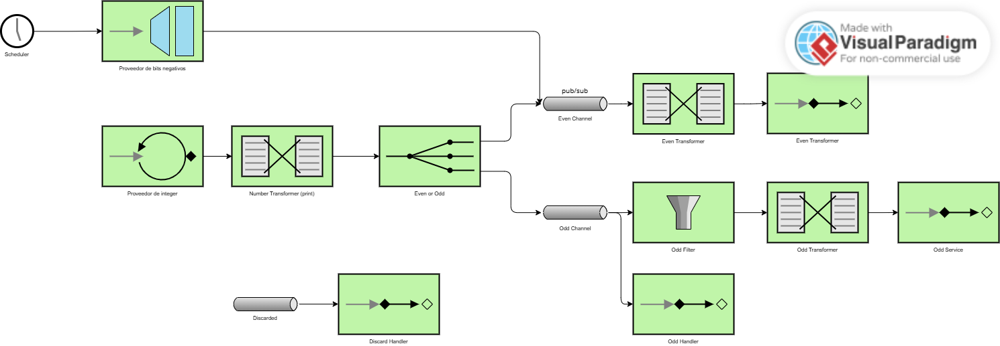

# Lab 5 Integration and SOA - Project Report

## 1. EIP Diagram (Before)

Describe what the starter code does and what problems you noticed.

Los problemas principales en el código inicial eran:
1. **Canal de Enrutamiento Incorrecto**: El flujo de integración inicial enviaba los números generados directamente a los canales `evenChannel` y `oddChannel` sin pasar por un canal intermedio. Esto causaba que los números no fueran correctamente enrutados según su paridad.
2. **Filtro de Números Impares Mal Configurado**: El filtro en el flujo de números impares no manejaba correctamente los números negativos. Esto resultaba en que los números negativos fueran rechazados en lugar de ser procesados adecuadamente.
3. **Canales Publicar-Suscribir Innecesarios**: Los canales `evenChannel` y `oddChannel` estaban configurados como canales publicar-suscribir, lo cual no era necesario para este caso de uso. Esto añadía complejidad innecesaria al flujo de mensajes.

---

## 2. What Was Wrong

Explain the bugs you found in the starter code:

- **Bug 1**: What was the problem? Why did it happen? How did you fix it?
- **Bug 2**: What was the second problem? Why did it happen? How did you fix it?
- **Bug 3**: What was the third problem? Why did it happen? How did you fix it?
- **(More bugs if you found them)**

---

## 3. What You Learned

Write a few sentences about:

- What you learned about Enterprise Integration Patterns
- How Spring Integration works
- What was challenging and how you solved it

---

## 4. AI Disclosure

**Did you use AI tools?** (ChatGPT, Copilot, Claude, etc.)

- If YES: Which tools? What did they help with? What did you do yourself?
- If NO: Write "No AI tools were used."

**Important**: Explain your own understanding of the code and patterns, even if AI helped you write it.

---

## Additional Notes

Any other comments or observations about the assignment.
